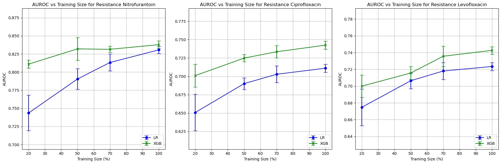
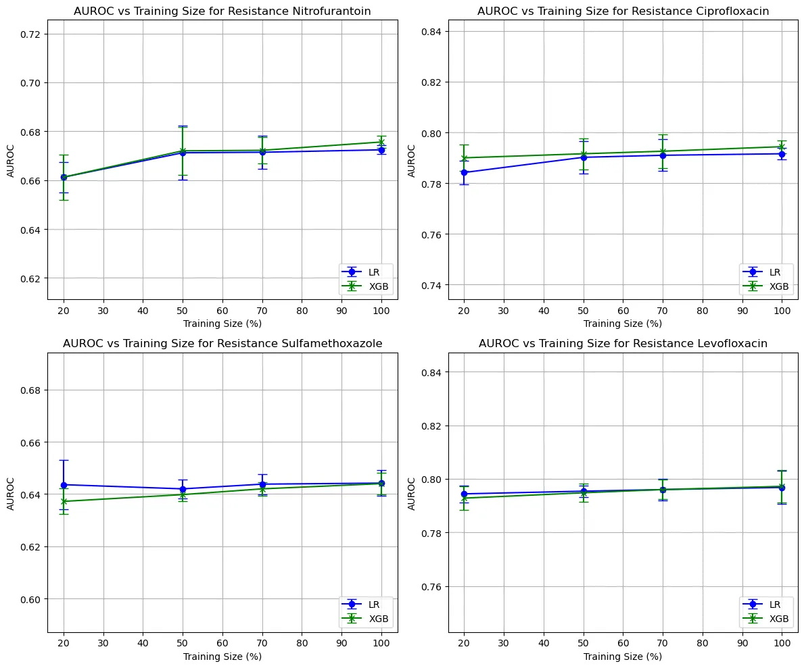
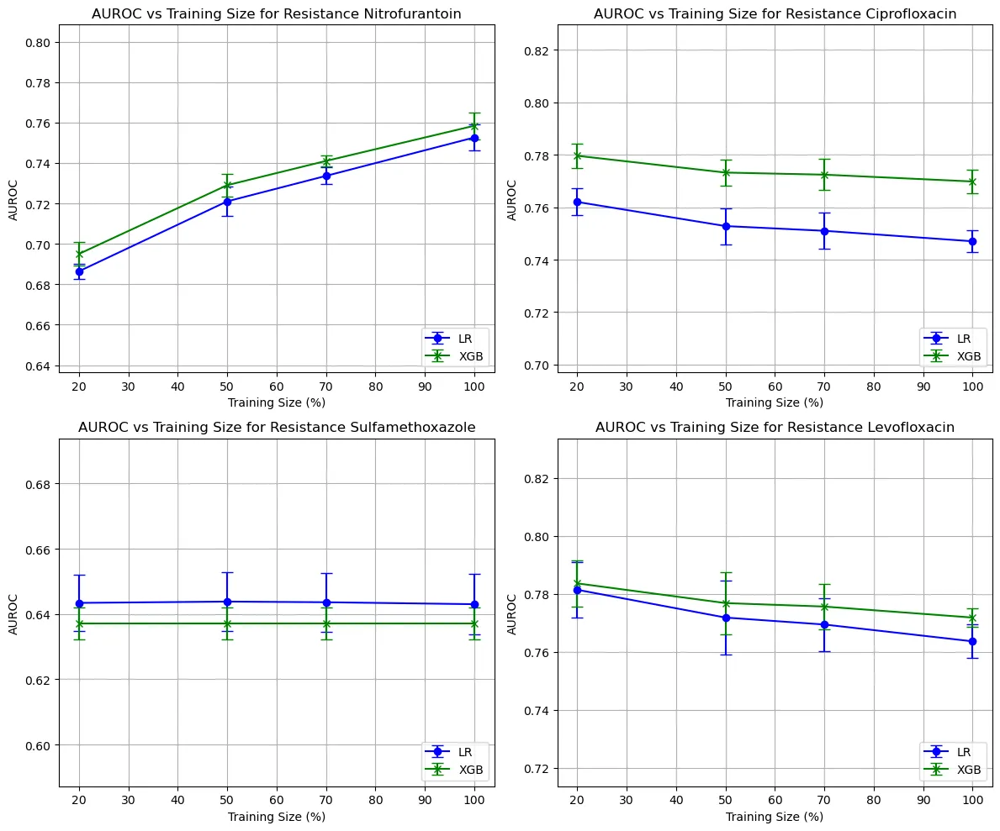
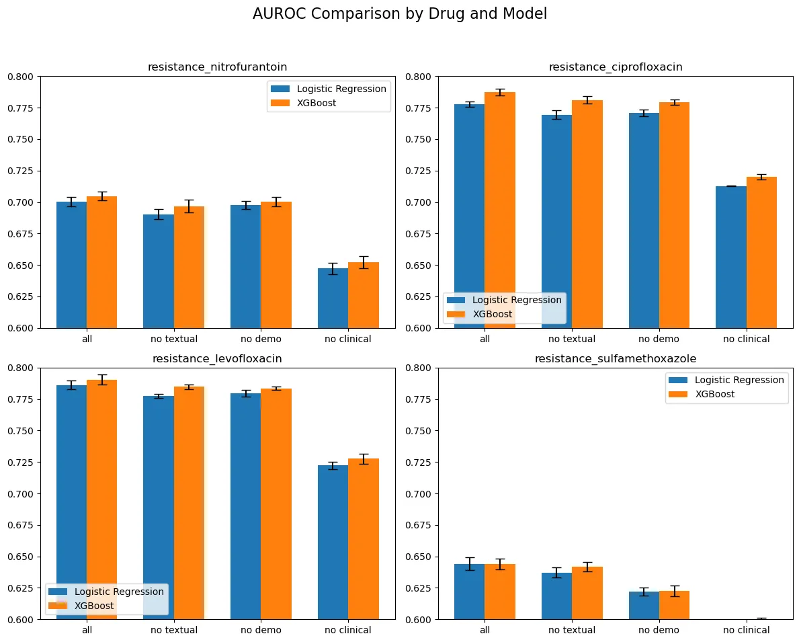

# Figure

### Size of Training Data
- figure1: models trained with different size of dubai dataset

<!-- <figure>
    
    <figcaption>figure1: models trained with different size of dubai dataset</figcaption>
</figure> -->

- figure2: models trained with different size of US dataset

- figure3: models trained with 20% of US dataset aned different size of Dubai dataset

### Modality

- figure4: models trained with different features

### Train on A Test on B

- figure5: 